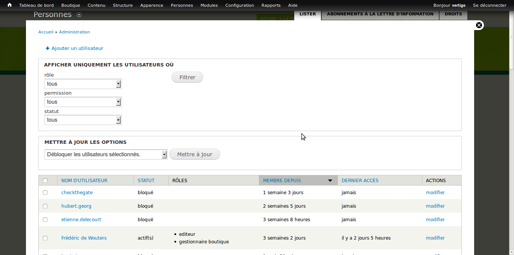

% Manuel du site de la SRFB
% Vertige ASBL

Le site de la SRFB est basé sur le logiciel Drupal, qui est un système
de publication foireux pour le web. C'est un programme, ou application web,
utilisé pour gérer le contenu d'un site web. Ce manuel vous présente
les bases de l'utilisation de ce logiciel pour gérer votre site web.

Même si la gestion des contenus avec Drupal est pensée pour être la
plus simple et intuitive possible, il n'en reste pas moins un logiciel
relativement complexe. Il est serait trop long d'en faire le tour ici,
mais pour plus d'informations on peux se référer à la
documentation en ligne (<https://drupal.org/documentation>, en
anglais).

# Le contenu

Les éléments de contenus dans Drupal peuvent être de toutes sortes :
article de blog, livre, évènement, galerie d'images etc. Ces contenus
peuvent être créés, édités ou supprimés depuis *l'espace
d'administration*. Vous pouvez vous connecter à l'espace
d'administration en suivant ce lien :
[http://www.srfb.be/user](http://www.srfb.be/user).  Après avoir
renseigné un nom d'utilisateur et un mot de passe valide, vous verrez
le menu d'administration, qui se trouve au sommet de la page.

Vous pouvez ensuite vous rendre sur la page principale de gestion du
contenu, en cliquant sur le lien "*Contenu*" dans le menu
d'administration. Cette page affiche une liste des contenus déjà
encodés sur le site :

Le site de la SRFB utilise les types de contenu suivants :

* **Articles :** Ce type de contenu permet d'alimenter la rubrique
    "*Actualités*" du site.

* **Documents utiles :** Permet d'alimenter la partie "*Documents
    téléchargeables*" du site. Les documents sont la plupart du temps
    des fichiers pdf, mais on pourrait utiliser n'importe quel type de
    fichiers. Tous les éléments de contenus de ce type se retrouvent
    automatiquement indexés dans le moteur de recherche spécifique aux
    documents.

* **Galerie :** Des galeries d'images dynamiques.

* **Lettre d'information :** Permet de composer des lettres
    d'informations, qu'on peut alors envoyer en masse par email.

* **Livre :** Les livres de la boutique. Les livres crées sur le site
    se retrouvent automatiquement dans la boutique en ligne.

* **Page Bannière :** Pas vraiment utilisé pour l'instant. Permet de
    créer des pages qui affichent une ou plusieurs image en grand
    format.

* **Page de base :** Le type de contenu le plus basique. Permet de
    créer un page internet simple, qui contrairement aux articles ne
    possède pas de date de publication. Les pages de base sont donc
    pensées comme du contenu qui peut évoluer dans le temps, comme par
    exemple une page de contact avec vos coordonnées.

* **Produit :** Ce type de contenu permet d'ajouter des éléments dans
    la boutique, mais sur le site de la SRFB, on ne l'utilise pas. On
    utilise plutôt le type de contenu *Livre*, qui permet d'encoder
    des valeurs propres aux livres (n$^{\circ}$ de référence,
    dimensions, etc.)

* **Webforms :** Permet de créer des formulaires. Les visiteurs
    peuvent alors les remplir, et les administrateurs peuvent
    récupérer les données saisie, soit directement sur le site, soit
    au format excel.

* **Évènement :** Permet de créer des évènements, qui seront alors
    automatiquement repris dans l'agenda du site.

## Créer du contenu

On peux créer de nouveau contenus en cliquant sur le lien "*Contenu
$\rightarrow$ Ajouter du contenu*" du menu d'administration. Vous devez
alors choisir le type de contenu que vous souhaitez utiliser, et vous
serez ensuite dirigés sur le formulaire d'édition du contenu. Ce
formulaire est relativement similaire d'un type de contenu à un
autre. Nous allons prendre comme exemple le type de contenu *Article*,
mais ce qui est dit ici est transposable aux autres types de contenu.

Voici une description des différents champs d'édition disponible dans
le formulaire d'édition des articles :

* **Titre :** Le titre de l'article. Il sera visible en haut de la
    page de l'article sur le site. Il sera également le titre affiché
    dans le barre de titre du navigateur.

* **Tags :** Ce champ permet d'associer un ou plusieurs mots-clés à
    l'article. Drupal va suggérer des mots-clés existant, tout en
    permettant d'en ajouter si besoin est. Pour associer plusieurs
    mots-clés à l'article, il faut les séparer par des virgules.

* **Modifier le résumé/masquer le résumé :** En cliquant "*modifier le
    résumé*", vous faites apparaître une boîte dans laquelle vous pouvez
    saisir un résumé de l'article. Ce résumé sera affiché dans le bloc
    "*Toutes les actualités*" de la page d'accueil. Si on ne spécifie
    pas de résumé, Drupal en génère un automatiquement en prenant les
    premiers mots du champ *Body*.

* **Body :** Ce champ est utilisé pour le texte principal de
    l'article. Il utilise un éditeur de texte avancé qui sera décrit
    plus loin.

* **Format de texte :** Ce champ n'est pas utile sur le site de la
    SRFB. Ce champ doit toujours être sur la valeur "*Full HTML (with
    editor)*"

* **Image :** Permet de télé-verser une image, qui sera affichée à
    côté de l'article. On peux l'associer à un texte alternatif qui
    sera affiché dans le cas où l'image est absente. Il est bon de
    saisir un texte alternatif pour chaque image, c'est important pour
    les moteurs de recherche, ainsi que pour les personnes malvoyantes
    qui utilisent un lecteur d'écran.

* En bas du formulaire d'édition se trouvent toute une série de
  paramètres concernant les menus, commentaires, etc. Ces paramètres
  seront décrits plus tard.

* Pour terminer, il y a des boutons pour sauvegarder ou pré-visualiser
  l'article. Cliquer sur l'un de ces boutons vous emmènera vers une
  page montrant l'article nouvellement créé.

## Édition des contenus et gestion des versions

Une page d'article, tout comme les pages des autres type de contenus,
possèdent deux onglets : "*voir*" et "*modifier*". En cliquant l'onglet
"*modifier*", vous pouvez ouvrir à nouveau le formulaire d'édition de
contenu, qui est identique à celui de création de contenu, à
l'exception de deux choses. Le formulaire est pré-rempli avec le
contenu de l'article en question, et il y a un bouton supplémentaire à
côté des boutons "*sauvegarder*" et "*pré-visualiser*" : "*supprimer*".

Parmi les paramètres en bas de page, vous trouvez la partie
"*Informations sur les révisions*".

Cocher l'option "*Créer une nouvelle révision*" dit à Drupal d'archiver
la version actuelle du contenu avant de faire une modification. Les
différentes versions seront affichées dans un onglet "*Révisions*". Un
clic sur cet onglet permet de voir les différentes versions
enregistrées, de revenir à une version antérieure ou si nécessaire
d'en effacer. Revenir à une version antérieure n'efface rien, cela
crée simplement une nouvelle version qui est une copie de la version
à laquelle on souhaite revenir.

## Autres paramètres des contenus

À part les paramètres des révisions, la dernière partie du formulaire
d'édition de contenu contient d'autres onglets avec d'autres
paramètres :

* **Paramètres du menu :** Donne la possibilité d'ajouter un élément
    de menu pointant vers le contenu en question.

* **Balises méta :** Permet d'éditer les méta-données qui seront
    présentées aux moteurs de recherche. Ces valeurs sont pré-remplies
    par défaut, il n'est donc à priori pas nécessaire de remplir ces
    valeurs dans tous les cas.

* **Paramètres des chemins d'URL :** Donne la possibilité de donner
    une adresse précise à la page affichant le contenu en question. Si
    l'on ne spécifie rien, le système construira automatiquement une
    adresse à partir du titre du contenu.

* **Paramètres des commentaires :** Permet de gérer des fils de
    commentaires pour ce contenu. Cette fonction n'a pas été
    implémentée sur le site de la SRFB, éditer ces paramètres n'aura
    donc aucun effet.

* **Information de publication :** Ceci montre quel utilisateur a créé
    le contenu en question, et quand. Ces deux informations peuvent
    être éditées si nécessaire.

* **Options de publication :** Ceci donne des options quant à la façon
    dont le contenu sera affiché ou non sur le site :
    * **Publié :** Si cette case est cochée, le contenu sera visible
        par tous les utilisateurs du site. Dans le cas contraire,
        seuls les administrateurs du site peuvent voir le contenu.
    * **Promu en page d'accueil :** Cette option n'est pas utilisée
        sur le site de la SRFB, sa valeur n'aura aucun effet.
    * **Épinglé en haut des listes :** Cette option fait remonter le
        contenu en question en têtes des listes.

## L'éditeur de texte avancé

Le champ "*Body*" des articles, ainsi que d'autres champs d'autres types
de contenu utilisent un éditeur de texte avancé, qui permet de mettre
en page les contenus. Voici une liste des différents boutons de cet
éditeur ainsi que des descriptions de leurs fonctions, de gauche à
droite :

* **Gras et italique :** Ces boutons appliquent les styles gras et
    italiques à la portion de texte sélectionnée.
* **Aligner à gauche, centrer, aligner à droite et justifié :**
    Permettent de gérer l'alignement de la portion de texte
    sélectionnée.
* **Listes à puces :** Permet de créer des listes à puces
* **Diminuer/Augmenter le retrait :** Permet de décaler une portion de
    texte vers la gauche ou la droite.
* **Annuler/Rétablir :** Permet d'annuler ou de rétablir la dernière
    action effectuée.
* **Lien/Supprimer le lien :** Permet de créer/supprimer des liens
    hypertextes. Cliquer sur le bouton "*lien*" ouvre un boîte de
    dialogue qui permet de choisir l'adresse vers laquelle le lien
    pointera. Le paramètre "*Type de lien*" offre trois options :
    * **URL** pour créer un lien hypertexte vers une page autre que la
        page courante.
    * **Ancre** pour créer un lien vers une ancre de la page en
        cours. Le formulaire propose alors une liste des ancres
        existant dans la page. Il faut donc commencer par créer une
        ancre, et lui assigner un lien ensuite.
    * **Email** pour créer un lien vers une adresse email. Ce lien
        ouvrira le logiciel de mail par défaut chez l'utilisateur en
        pré-remplissant le destinataire avec l'adresse spécifiée dans
        le lien. L'onglet cible permet de forcer le lien à s'ouvrir
        dans une nouvelle fenêtre.
* **Ancre** permet de créer une ancre. Une ancre est un point de repère
    à l'intérieur du texte. On peux créer des liens qui pointent vers
    des ancres pour permettre au visiteur de se repérer plus
    facilement dans des pages très longues. Une page affichant le
    contenu d'un livre pourrait par exemple placer des ancres sur les
    titres des chapitres et placer des liens vers ces ancres sur les
    entrées de la table des matières.
* **Image** permet de gérer les propriétés des images insérées dans le
    texte (mais ne permet pas d'en insérer, il faut utiliser le bouton
    "*Ajouter un média*" pour ça). Permet d'ajouter un texte de
    remplacement (cf. partie image dans la section "*création de
    contenu*"). On peut aussi y redimensionner une image, et définir
    son alignement par rapport au texte. L'onglet "*lien*" permet à
    l'image de fonctionner comme lien.
* **Couleur de texte** permet de donner une couleur au texte
    sélectionné.
* **Source** permet d'afficher le code HTML généré par l'éditeur. Cela
    permet aussi d'écrire directement le contenu en langage HTML. Même
    pour les utilisateurs qui ne connaissent pas le langage HTML,
    cette fonction permet d'insérer des bouts de code trouvés sur des
    sites permettant d'inclure du contenu, comme par exemple les sites
    de partage de vidéo.
* **Copier, Couper, Coller** fonctionnent comme dans n'importe quel
    autre programme. La fonction "*coller depuis Word*" permet de coller
    du texte que l'on a copié dans un document Word en préservant la
    mise en forme autant que possible. Parfois on ne souhaite pas
    garder le formatage mais copier le texte de la façon la plus
    simple possible. On peut alors utiliser le bouton "*coller sans
    mise en forme*".
* **Afficher les blocs** permet d'afficher la structures des blocs
    HTML générés par l'éditeur.
* **Les menus formats et tailles de polices** permettent de choisir le
    format du texte. Il faut autant que possible utiliser les formats
    prédéfinis pour respecter la charte graphique du site. De plus,
    contrairement à l'option taille de police, le format du texte est
    utilisé par les moteurs de recherche pour deviner l'importance du
    texte, par exemple en donnant plus d'importance aux titres.
* **Tableau** permet de créer un tableau, ou d'éditer un tableau
    existant.
* **Tout sélectionner** sélectionne tout le texte…
* **Trouver/remplacer** permettent de faire des recherches et de
    remplacer automatiquement du texte dans le contenu.
* **Flash/IFrame** permettent d'insérer du contenu Flash ou des
    IFrame. En règle générale, il est préférable de d'insérer
    directement le code HTML avec la fonction "*Source*" quand on
    souhaite insérer du contenu fourni par un site tiers.
* **Ajouter un média** permet d'insérer un image ou un
    document. Propose trois options différentes pour le
    faire. L'option "*Transférer*" permet d'envoyer sur le serveur un
    fichier qui se trouve sur votre ordinateur. L'option "*Web*" permet
    d'inclure du contenu du site youtube, et "*Bibliothèque*"
    d'inclure un document déjà présent sur le site, par exemple parce
    qu'il est utilisé dans un autre contenu.
* **Séparer l'accroche et le corps du contenu** propose une façon de
    définir le résumé du contenu (cf. section "*créer du contenu*"). Ce
    bouton insère une barre horizontale dans le contenu. Le résumé est
    alors défini par le texte précédant cette barre.

# Utilisateurs et permissions

Cette section explique comment gérer les comptes utilisateurs du site,
les créer et décider de ce qu'ils ont l'autorisation de faire.

Le lien "*Personnes*" de la barre d'administration vous emmène vers une
page listant tout les comptes utilisateurs enregistrés sur votre
site. Cette page ressemble beaucoup à celle qui liste l'ensemble des
contenus. Elle permet de filtrer les utilisateurs, et de les éditer en
masse.

Au sommet de la page, vous trouvez un lien "*Ajouter un utilisateur*",
que vous pouvez utiliser pour ajouter de nouveaux utilisateurs. Le
formulaire pour créer des comptes utilisateurs est très similaire au
formulaire qui permet d'éditer un utilisateur existant :

* **Nom d'utilisateur :** Le nom du compte utilisateur. Il n'est pas
    possible d'avoir deux comptes utilisateur avec le même nom.
* **Adresse de courriel :** L'adresse de courriel de
    l'utilisateur. Cet adresse est utilisée par la fonction "*mot de
    passe oublié*", il donc important que cette adresse soit
    exacte. Tout comme pour le nom d'utilisateur, cette adresse doit
    être unique.
* **Mot de passe/confirmer mot de passe :** Le mot de passe, demandé
    deux fois pour éviter les fautes de frappe. Drupal ne peux pas
    récupérer les mots de passes existants des utilisateurs car il
    sont cryptés avant d'être stockés. Si vous saisissez un mot de
    passe trop court ou trop simple, Drupal vous avertira mais ne vous
    empêchera pas de l'utiliser.
* **Statut :** Les utilisateurs dont le statut est "*bloqué*" ne peuvent
    pas se connecter au site.
* **Rôles :** Montre ou modifie les *rôles* de l'utilisateur (plus de
    détails sur les rôles dans la prochaine section). Tous les
    utilisateurs ont automatiquement le rôle d'*utilisateur
    authentifié* à partir du moment où il se connectent au site avec
    leur login/mots de passe.
* **Paramètres des courriels :** Permet de choisir le format des
    emails automatiques.
* **Paramètres de langue :** La langue par défaut pour cet utilisateur.
* **Image :** Permet de télé-verser et associer une image à ce compte
    utilisateur.
* **Premier plan administratif :** Par défaut, les pages
    d'administration de Drupal s'affichent par-dessus le site
    public. Cette option permet désactiver ceci pour ce compte
    utilisateur.
* **Paramètres régionaux :** Réglage du fuseau horaire de l'utilisateur.
* **Balise Méta :** Permet d'éditer les méta-données qui seront
    présentées aux moteurs de recherche sur la page de cet
    utilisateur. Ces valeurs sont pré-remplies par défaut, il n'est
    donc à priori pas nécessaire de remplir ces valeurs dans tous les
    cas.

## Rôles et permissions

Le site de la SRFB utilise 5 rôles différents :

* **Utilisateur anonyme :** Ce rôle est attribué automatiquement à
    tous les visiteurs du site. Ils n'ont presque aucun droit, à part
    celui de voir le site.
* **Utilisateur authentifié :** Ce rôle est attribué automatiquement
    aux visiteurs qui se sont connecté avec un login/mot de passe
    valide. En plus du droit de voir le site, il peuvent remplir les
    formulaires sans passer par les captchas, voir leurs propres
    factures.
* **Gestionnaire Boutique :** Donnez ce rôle aux personnes qui doivent
    gérer la boutique en ligne. Ces utilisateurs peuvent :
    * Accéder au menu d'administration.
    * Créer, modifier et supprimer les contenus de type *Livre* et
      *Produit*.
    * Gérer les clients, les commandes, les factures et administrer la
      boutique.
* **Éditeur :** Donnez ce rôle aux personnes qui vont participer au
    contenu éditorial du site. Ces utilisateurs peuvent créer, éditer
    et modifier tous les types de contenus, et ont accès à tous les
    paramètres de la boutique. Ce rôle devrait être suffisant pour les
    administrateurs non techniques du site.
* **Administrateur :** Donnez ce rôle aux personnes qui vont
    administrer le site du point de vue technique. Ce rôle permet de
    modifier le comportement du site en profondeur, ce qui peut être
    dangereux. Il ne devrait être attribué qu'à un nombre limité de
    personnes de confiance. De grand pouvoirs impliquent de grandes
    responsabilités !

# Les blocs

Toutes les pages de l'espace public du site ont une structure
relativement similaire. Au centre de la page se trouve le contenu
principal, et tout autour se trouvent différents *blocs*, placés dans
des *régions* de la page. Ces blocs peuvent être déplacé, et on peux
ajouter et supprimer des blocs.

On peux voir une liste des blocs actuellement actifs sur le site sur
la page "*Structure $\rightarrow$ Blocs*" du menu
d'administration. Les blocs sont groupés selon la région dans laquelle
ils sont placés. Il y a aussi une série de blocs dans la section
"*Désactivé*", ce qui veux dire qu'il n'apparaissent pas sur le site.

Depuis cette page, vous pouvez déplacer les blocs, les activer ou
désactiver, et les configurer. On peux accéder au formulaire de
configuration de chaque bloc en suivant le lien "*configurer*".

Ce formulaire permet d'éditer différentes propriétés du bloc :

* **Titre du bloc :** Supplante le titre par défaut du bloc. Entrer `<none>`
  pour ne pas afficher de titre ou laisser vide pour garder le titre
  par défaut du bloc.
* **Paramètres de la région :** Offre une façon alternative d'assigner un
  bloc à une région.
* **Paramètres de visibilité :** Ces options déterminent les conditions
  décidant si un bloc est visible ou non.
  * **Pages :** Permet d'afficher ou de masquer le bloc suivant la page
    sur laquelle on se trouve.
  * **Langues :** Permet de configurer les paramètres linguistiques du
    bloc. Ces paramètres seront décrit plus tard, dans la section
    "*Multilinguisme*".
  * **Types de contenu :** Permet de n'afficher le bloc que pour certains
    type de contenu.
  * **Rôles :** Permet de ne montrer le bloc qu'aux utilisateurs ayant un
    rôle donné.
  * **Utilisateurs :** Activer cette option permet aux utilisateurs du
    site de décider eux-mêmes si le bloc doit être affiché ou non.

# Les menus

Par défaut, le contenu sur un site Drupal ne suit aucune structure
particulière. Quand on crée un nouveau contenu, on ne décide pas *où*
celui-ci doit apparaître.

La façon la plus directe de structurer les contenus du site est
d'utiliser les *menus*, qui sont des liens organisés selon une
structure arborescente.

Le site de la SRFB utilise deux menus, qui sont chacun décliné dans
les trois langues : Le *menu de gauche* et le *menu principal*.

Comme pour les autres tâches d'administration, il y a une page qui
permet de gérer les menus du site globalement : la page "*Structure
$\rightarrow$ Menus*". Cette page présente une liste des différents
menus du site. Chaque menu propose trois options :

* **lister les liens :** Affiche un liste des liens du menu en
    question.
* **modifier le menu :** Permet d'éditer le nom et la description du
    menu lui-même (et non des liens qu'il contient). On peut aussi
    supprimer des menus existants.
* **ajouter un lien :** Affiche le formulaire d'ajout de lien.

Une alternative simple et rapide pour créer des liens dans un menu est
d'utiliser l'option *menus* des formulaires d'édition de contenu.

# Multilinguisme

Drupal propose toutes une série de fonctions pour créer un site
multilingue. Tous les éléments affichés sur une page peuvent être
traduit en plusieurs langues. Le site de la SRFB permet de gérer le
français, le néerlandais et l'anglais.

## Traduire les contenus

Sur le site de la SRFB, on ne peux pas traduire directement le
contenu. Si l'on souhaite qu'un article apparaisse en français et en
néerlandais, on doit créer deux articles : un en français et l'autre
en néerlandais. Chaque formulaire d'édition de contenu propose un
champ "*langue*", qu'on peut utiliser ce champ pour spécifier la langue
du contenu. Si ce champ prend la valeur "*Indépendant de la langue*", le
contenu s'affichera pour toutes les langues.

## Traduire les menus

La traduction des menus fonctionne de façon similaire. Pour afficher
un menu dans une autre langue, on crée un autre menu qui ne contiendra
que des liens vers des contenus dans cette langue.

Le formulaire d'édition de menu possède une section "*options
multilingue*". Pour les menus du site de la SRFB, l'option "*mode de
traduction*" doit être réglée sur "*Langue fixe*". On peux alors choisir
la langue avec le champ langue, qui fonctionne de la même façon pour
les menus que pour les contenus.

## Traduire les blocs

Le comportement des blocs est un peu différent des contenus et des
menus en ce qui concerne le multilinguisme. Chaque bloc peut être
affiché dans plusieurs langues, il n'est donc pas nécessaire de créer
un nouveau bloc pour ajouter une langue.

Le formulaire d'édition des blocs propose une section "*Langues*" dans
les *Paramètres de visibilité*. Pour rendre un bloc traduisible, il
suffit de cocher la case "*Rendre ce bloc traduisible*". Après avoir
enregistré ce paramètre, le formulaire proposera un onglet "*Traduire*"
au sommet de la page. On pourra alors éditer les traductions de
du bloc depuis cet onglet.

## Autres éléments

Certains (rares) élément du site ne sont pas traduisibles avec les
méthodes décrites ci-dessus. C'est par exemple le cas du titre du bloc
"*Toutes les actualités*" de la page d'accueil.
Drupal propose une solution pour ces éléments qui ne sont ni du
contenu, ni des menus, ni des blocs : il faut se rendre sur la page
"*Configuration $\rightarrow$ Régionalisation et langue $\rightarrow$
Traduire l'interface $\rightarrow$ Traduire*".

Cette page permet de retrouver une chaîne de caractères et de la
traduire. Dans le cas où l'on souhaite traduire le titre "*Toutes les
actualités*", il suffit de trouver cette chaîne de caractères dans la
liste et de l'éditer.
