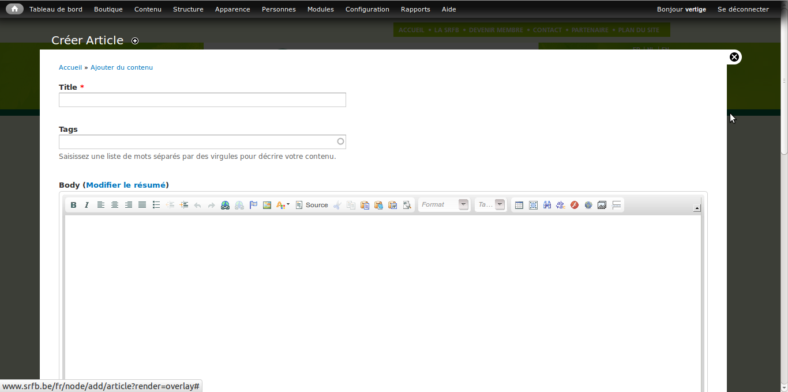

# Manuel Utilisateur Drupal

Drupal est un système de publication pour le web. C'est un programme,
ou application web, utilisé pour gérer le contenu d'un site web. Ce
manuel vous présente les bases de l'utilisation de ce logiciel pour
gérer le contenu de votre site web.

Même si la gestion des contenus avec Drupal est pensée pour être la
plus simple et intuitive possible, il n'en reste pas moins un logiciel
relativement complexe. Il est impossible de faire le tour de ses
possibilités ici, mais pour plus d'informations on peux se référer à
la [documentation en ligne](https://drupal.org/documentation) (en
anglais).

## Le contenu

Les éléments de contenus dans Drupal peuvent être de toutes sortes :
article de blog, livre, évènement, galerie d'images etc. Ces contenus
peuvent être créés, édités ou supprimés depuis *l'espace
d'administration*. Vous pouvez vous connecter à l'espace
d'administration en suivant ce lien :
[http://www.srfb.be/user](http://www.srfb.be/user).  Après avoir
renseigné un nom d'utilisateur et un mot de passe valide, vous verrez
le menu d'administration, qui se trouve au sommet de la page.

Vous pouvez ensuite vous rendre sur la page principale de gestion du
contenu, en cliquant sur le lien "Contenu" dans le menu
d'administration. Cette page affiche une liste des contenus déjà
encodés sur le site :

Le site de la SRFB utilise les types de contenu suivants :

* **Articles :** Ce type de contenu permet d'alimenter la rubrique
    "Actualités" du site.

* **Documents utiles :** Permet d'alimenter la partie "Documents
    téléchargeables" du site. Les documents sont la plupart du temps
    des fichiers pdf, mais on pourrait utiliser n'importe quel type de
    fichiers. Tous les éléments de contenus de ce type se retrouvent
    automatiquement indexés dans le moteur de recherche spécifique aux
    documents.

* **Galerie :** Des galeries d'images dynamiques.

* **Lettre d'information :** Permet de composer des lettres
    d'informations, qu'on peut alors envoyer en masse par email.

* **Livre :** Les livres de la boutique. Les livres crées sur le site
    se retrouvent automatiquement dans la boutique en ligne.

* **Page Bannière :** Pas vraiment utilisé pour l'instant. Permet de
    créer des pages qui affichent une ou plusieurs image en grand
    format.

* **Page de base :** Le type de contenu le plus basique. Permet de
    créer un page internet simple, qui contrairement aux articles ne
    possède pas de date de publication. Les pages de base sont donc
    pensées comme du contenu qui peut évoluer dans le temps, comme par
    exemple une page de contact avec vos coordonnées.

* **Produit :** Ce type de contenu permet d'ajouter des éléments dans
    la boutique, mais sur le site de la SRFB, on ne l'utilise pas. On
    utilise plutôt le type de contenu "Livre", qui permet d'encoder
    des valeurs propres aux livres (n$^{\circ}$ de référence,
    dimensions, etc.)

* **Webforms :** Permet de créer des formulaires. Les visiteurs
    peuvent alors les remplir, et les administrateurs peuvent
    récupérer les données saisie, soit directement sur le site, soit
    au format excel.

* **Évènement :** Permet de créer des évènements, qui seront alors
    automatiquement repris dans l'agenda du site.

### Créer du contenu

On peux créer de nouveau contenus en cliquant sur le lien `Contenu ->
Ajouter du contenu` du menu d'administration. Vous devez alors choisir
le type de contenu que vous souhaitez utiliser, et vous serez ensuite
dirigés sur le formulaire d'édition du contenu. Ce formulaire est
relativement similaire d'un type de contenu à un autre. Nous allons
prendre comme exemple le type de contenu "Article", mais ce qui est
dit ici est transposable aux autres types de contenu.

Voici une description des différents champs d'édition disponible dans
le formulaire d'édition des articles :

* **Titre :** Le titre de l'article. Il sera visible en haut de la
    page de l'article sur le site. Il sera également le titre affiché
    dans le barre de titre du navigateur.

* **Tags :** Ce champs permet d'associer un ou plusieurs mots-clés à
    l'article. Drupal va suggérer des mots-clés existant, tout en
    permettant d'en ajouter si besoin est. Pour associer plusieurs
    mots-clés à l'article, il faut les séparer par des virgules.

* **Modifier le résumé/masquer le résumé :** En cliquant "modifier le
    résumé, vous faites apparaître une boîte dans laquelle vous pouvez
    saisir un résumé de l'article. Ce résumé sera affiché dans le bloc
    "Toutes les actualités" de la page d'accueil. Si on ne spécifie
    pas de résumé, Drupal en génère un automatiquement en prenant les
    premiers mots du champs "body".

* **Body :** Ce champ est utilisé pour le texte principal de
    l'article. Il utilise un éditeur avancé qui sera décrit plus loin.

* **Format de texte :** Ce champ n'est pas utile sur le site de la
    SRFB. Ce champ doit toujours être sur la valeur "Full HTML (with
    editor)"

* **Image :** Permet de télé-verser une image, qui sera affichée à côté
    de l'article. On peux associer cette image à un texte alternatif
    qui sera affiché dans le cas où l'image est absente. Il est
    important de saisir un texte alternatif pour chaque image pour les
    moteurs de recherche, ainsi que pour les personnes malvoyantes qui
    utilisent un lecteur d'écran.

* En bas du formulaire d'édition se trouvent toute une série de
  paramètres concernant les menus, commentaires, etc. Ces paramètres
  seront décrits plus tard.

* Pour terminer, il y a des boutons pour sauvegarder ou pré-visualiser
  l'article. Cliquer sur l'un de ces boutons vous emmènera vers une page
  montrant l'article nouvellement créé.

